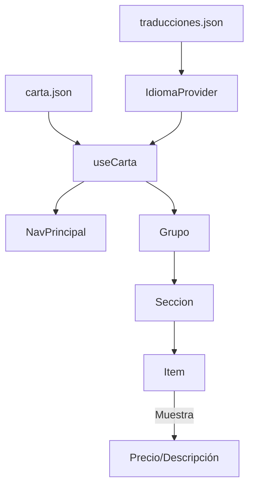

# Test de Carta Digital con Gestor de Idioma

Esta aplicación es una prueba de una carta digital que incluye un gestor de idiomas. Permite a los usuarios cambiar entre diferentes idiomas para visualizar el contenido de manera personalizada. Ideal para restaurantes o negocios que necesitan ofrecer menús multilingües.

## Características
- Cambio dinámico de idioma.
- Interfaz amigable y fácil de usar.
- Configuración adaptable para diferentes necesidades.

## Requisitos
- Node.js
- React

## Instalación
1. Clona este repositorio.
2. Ejecuta `npm install` para instalar las dependencias.
3. Usa `npm start` para iniciar la aplicación.

## Contribución
¡Las contribuciones son bienvenidas! Por favor, abre un issue o envía un pull request.

## Licencia
Este proyecto está bajo la Licencia MIT.

## Arquitectura:
